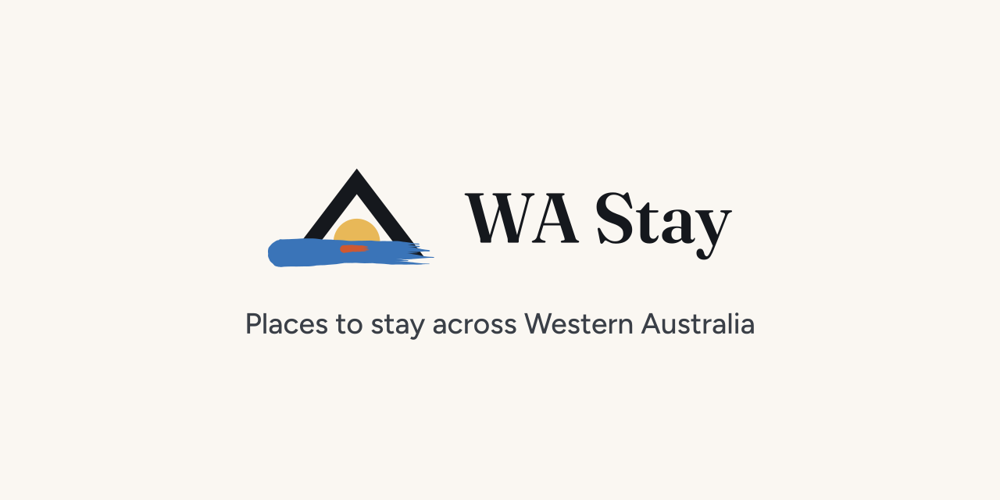
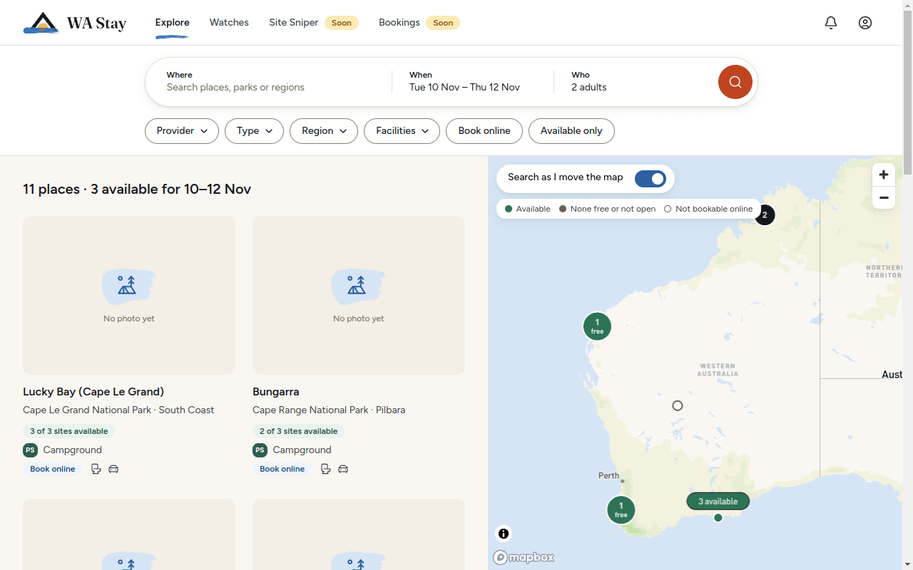
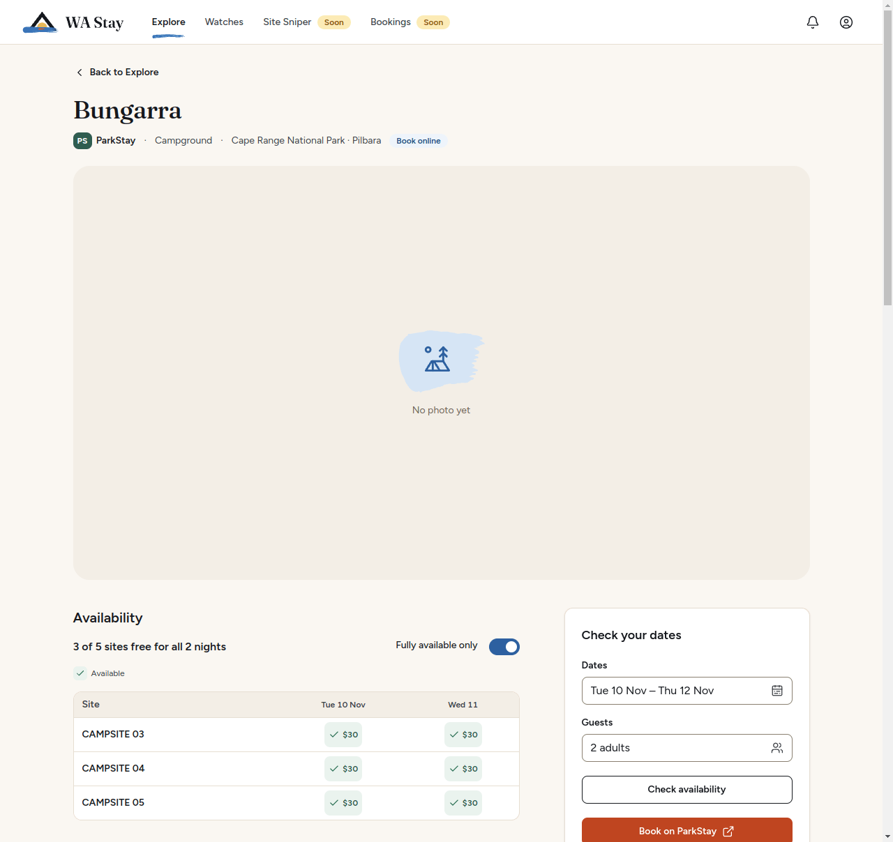
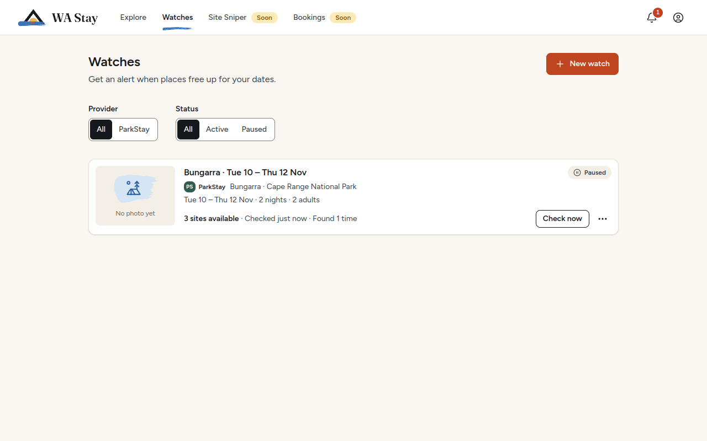

<p align="center">
  
</p>

<h1 align="center">
  
  WA Stay
</h1>

<p align="center">
  <strong>Find and book places to stay across Western Australia.</strong>
</p>

<p align="center">
  A map of every place, availability for your dates, watches that tell you when a site frees
  up, and help getting hard-to-book sites, from the providers that own them. ParkStay WA's
  national-park campgrounds come first; RAC Parks &amp; Resorts is planned next.
</p>

<p align="center">
  <a href="https://github.com/wilsonwaters/wa-stay/releases/latest"><strong>Download for Windows</strong></a>
  ·
  <a href="docs/user-guide.md">User guide</a>
  ·
  <a href="docs/README.md">Documentation</a>
</p>

WA Stay is a Windows desktop app. It grew out of an app that automated ParkStay campground
bookings: ParkStay is now one **provider** among the ones to come, and existing users are
[upgraded automatically](#upgrading-from-wa-parkstay-bookings), data and all.



## Features

- **Explore.** Every place from every provider on a map of WA and in a list: search by place,
  park or region; filter by provider, type, region, facilities, online booking and
  availability; add your dates and guests to see how many sites are free on every pin and card.
  Without a map token it works as a list.
- **Place pages.** Photos, the provider's description and facilities, the park and region,
  every site night by night with prices for your dates, and links to book or read more on the
  provider's own site.
- **Watches.** Choose a place, dates and the sites you want; WA Stay checks on a schedule (from
  every 15 minutes to daily) and tells you when something frees up, even for only some nights,
  with a price limit if you like. For ParkStay a watch can also hold the site for you.
- **Notifications.** An in-app notification list, desktop notifications that open the right
  page, and email through your own email account (Gmail, Outlook or any SMTP server).
- **The DBCA queue.** WA Stay waits in ParkStay's virtual queue when it is on, shows your place,
  and keeps the session alive while it is needed.
- **Provider accounts.** Sign in to ParkStay in the app, on ParkStay's own page (optional;
  holds work without it).
- **Site Sniper** *(coming soon)*. Hold a hard-to-get site the moment it is released: when
  ParkStay opens a new date, at a scheduled block release, or when someone cancels. You pay for
  the hold on ParkStay's own page, in the app.
- **Bookings** *(coming soon)*. Your trips from every provider in one place, with links to
  manage them on the provider's site; holds you pay for in the app are added for you.
- **Private and local.** Your data stays on your computer. WA Stay has no account, cloud
  service or analytics of its own; it talks to the providers, Mapbox (the map, whose library
  also reports its usage to Mapbox), GitHub (updates) and your email server if you set one up.

Site Sniper and Bookings work but are still being finished, so the navigation marks them
**Soon**.





## Providers

| Provider | Status | Explore | Availability | Watches | Site Sniper | Holds and payment | Account |
| --- | --- | --- | --- | --- | --- | --- | --- |
| **ParkStay WA** (DBCA national-park campgrounds) | Built in | Yes, 169 campgrounds | Yes, per night with prices | Yes | Coming soon | Yes (30-minute holds, paid on ParkStay) | Optional |
| **RAC Parks & Resorts** | Planned | | | | | | |

Providers are modules behind a provider SDK, so more can be added, including sites with no
API: see [adding a provider](docs/providers/adding-a-provider.md).

## Download

**[Download the latest release](https://github.com/wilsonwaters/wa-stay/releases/latest)**
(Windows 10 or later, 64-bit):

- **`WA-Stay-Setup-x.y.z.exe`**: the installer. Recommended; it keeps itself up to date.
- **`WA-Stay-Portable-x.y.z.exe`**: runs without installing; download each new version yourself.

WA Stay is not code-signed yet, so Windows SmartScreen may warn you: choose **More info**, then
**Run anyway**. macOS and Linux builds are not released; you can
[build from source](#building-from-source). Full instructions: [installation](docs/installation.md).

## Upgrading from WA ParkStay Bookings

Your copy of WA ParkStay Bookings updates itself to WA Stay, or you can run the new installer.
Either way:

- **Your data is copied on the first start** to `%APPDATA%\WA Stay`: watches, snipes, bookings,
  notifications, settings and email settings. The old folder, `%APPDATA%\parkstay-bookings`, is
  kept untouched as a backup; delete it once you have checked everything is there.
- **Shortcuts are renamed** to WA Stay. A taskbar pin made for the old version points at the
  old program (`WA ParkStay Bookings.exe`): unpin it and pin WA Stay from its new shortcut.
- **The install folder:** an automatic update keeps the old program folder
  (`%LOCALAPPDATA%\Programs\WA ParkStay Bookings\`), and running the installer by hand puts WA
  Stay in a `WA Stay` subfolder of it. Both work.
- **Launch at login carries over**, with **Start minimised** turned on (the old version always
  started hidden).
- **Your saved ParkStay password is no longer used** and is not carried over (your ParkStay
  email is). Connect ParkStay once in **Settings → Accounts** if you like: ParkStay emails you a
  code. It is optional; holds work without it.
- **Gmail OTP is removed.** WA Stay deletes its own copy; the old folder keeps
  `gmail-oauth.json`, which is safe to delete. Revoke the app's access in your
  [Google account](https://myaccount.google.com/permissions).
- **Going back to WA ParkStay Bookings is not supported.**

Details: [upgrading from WA ParkStay Bookings](docs/installation.md#upgrading-from-wa-parkstay-bookings).

## Building from source

You need **Node.js 24** (npm 10 or later; `.nvmrc` says 24) and Git. On Windows, also install
the Node.js installer's **Tools for Native Modules** (Python and the C++ build tools): `npm ci`
runs node-gyp for better-sqlite3, which needs them even though it compiles nothing.

```bash
git clone https://github.com/wilsonwaters/wa-stay.git
cd wa-stay
npm ci
cp .env.example .env         # optional: MAPBOX_ACCESS_TOKEN=pk.your-token-here
npm run build
npx electron .               # or npm run dist:win for the Windows installer
```

- **The map** needs a **public** Mapbox token (`pk.`) in `.env`; it is bundled into the app. A
  secret `sk.` token fails the build. Without a token, Explore shows a list.
- **better-sqlite3 is native**, but ships one prebuilt Node-API binary that both the Jest tests
  (Node) and the app (Electron) load: there is nothing to rebuild. `npx electron .` downloads
  the Electron binary the first time it runs.

## Development

```bash
npm run dev     # terminal 1: main in watch mode, the preload bundle, Vite on port 3000
npm start       # terminal 2: Electron on the dev server
```

| Script | What it does |
| --- | --- |
| `npm run build` | Production build into `dist/` |
| `npm run dist:win` | The Windows installer and portable exe in `release/` |
| `npm test` | Jest unit and integration tests (main and renderer) |
| `npm run test:tz` | The timestamp tests in Perth time |
| `npm run build:e2e` then `npm run test:e2e` | The Electron smoke tests on the built app, network-free (`xvfb-run -a` on Linux without a display) |
| `npm run test:electron` | Live Electron tests of the HTTP transport and provider windows |
| `npm run smoke:packaged` | Starts the packaged Linux app and checks it opens and quits |
| `npm run docs:screenshots` | Retakes the screenshots in `docs/images/` |
| `npm run lint`, `npm run format:check`, `npm run type-check` | The checks CI runs with `npm test` |

Stack: Electron 44, React 19, TypeScript 5, Vite 5, Tailwind CSS 4, SQLite (better-sqlite3),
React Query, Mapbox GL JS, playwright-core, Jest 29 and Playwright. Start with
[development](docs/development.md) and the [architecture overview](docs/architecture/overview.md);
[CLAUDE.md](CLAUDE.md) has the code conventions.

## Documentation

- [User guide](docs/user-guide.md), [installation](docs/installation.md),
  [troubleshooting](docs/troubleshooting.md)
- [Watches and notifications](docs/watches-and-notifications.md), [Site Sniper](docs/site-sniper.md)
- [Architecture overview](docs/architecture/overview.md), [security](docs/security.md),
  [development](docs/development.md)
- [Providers](docs/providers/README.md), [adding a provider](docs/providers/adding-a-provider.md),
  [ParkStay endpoints](docs/providers/parkstay/endpoints.md)
- [Release process](docs/release-process.md), [changelog](CHANGELOG.md)
- Everything: [docs/README.md](docs/README.md)

The repository was called `wilsonwaters/parkstay-bookings`; it is being renamed to
`wilsonwaters/wa-stay`, and old links and installed copies follow GitHub's redirect.

## Disclaimer

WA Stay is an independent project. It is not affiliated with, endorsed by or connected to the
Department of Biodiversity, Conservation and Attractions (DBCA), Parks and Wildlife Service WA,
Tourism Western Australia or any other provider. Places, photos and availability come live from
the providers and remain theirs.

Each provider's terms apply when you use it through WA Stay. For ParkStay that means one account
per person, one booking per night, bookings in the name of someone staying, and genuine intent:
hold only what you will use, and never book for others or resell. Payment is always completed by
you, on the provider's own site. Use WA Stay responsibly; the authors are not responsible for
bookings, account issues or breaches of a provider's terms.

## License

WA Stay is released under the [MIT License](LICENSE).
