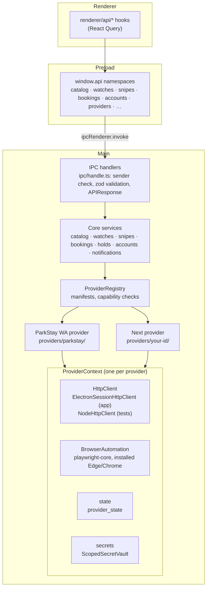

# Architecture overview

WA Stay is an Electron 28 desktop app: React 18 and TypeScript 5 in the window, Node in the
main process, SQLite (better-sqlite3) on disk. This page is the map; the binding decisions
behind it are in `ai-state/architecture-notes.md`, and the conventions for working in the code
are in [CLAUDE.md](../../CLAUDE.md).

## Contents

- [Processes](#processes)
- [Source layout](#source-layout)
- [Start-up and the composition root](#start-up-and-the-composition-root)
- [Providers](#providers)
- [Data model](#data-model)
- [Security](#security)
- [Upgrading from WA ParkStay Bookings](#upgrading-from-wa-parkstay-bookings)
- [Decisions](#decisions)

## Processes

| Process | Code | What it does |
| --- | --- | --- |
| Main | `src/main/` (Node, compiled by `tsc` to `dist/main/`) | Owns the database, the providers and every network request, the scheduler, notifications, the provider sign-in and payment windows, the auto-updater. |
| Preload | `src/preload/index.ts` (bundled by esbuild to `dist/preload/index.js`) | Exposes `window.api`, built from the IPC contract, in the sandboxed window. It imports nothing but `electron`; the build fails otherwise. |
| Renderer | `src/renderer/` (React, built by Vite to `dist/renderer/`) | The UI. It reaches main only through `window.api`, and only in `renderer/api/` (React Query hooks). |

Shared code (`src/shared/`) is plain TypeScript both sides compile: the IPC contract, domain
types and zod schemas, calendar-date helpers. It never imports Node or Electron.

## Source layout

```text
src/
├── main/
│   ├── app/          # composition root (container.ts), paths, main window, CSP, single instance,
│   │                 # provider sign-in/payment windows, launch at login, quit hold, local profile
│   ├── core/         # provider-agnostic services: catalog, watches, snipes, bookings, holds,
│   │                 # accounts, notifications (+ notifiers/), stay-param rules
│   ├── providers/    # sdk/ (the provider SDK), registry.ts, index.ts (built-ins), parkstay/
│   ├── database/     # connection.ts (schema and every migration), repositories/
│   ├── ipc/          # handle.ts, sender guard, renderer events, handlers/ (one per namespace)
│   ├── scheduler/    # job scheduler: watch loop, snipe timer chains, retention job
│   ├── security/     # SecretVault (Electron safeStorage), v1.x secret migration
│   ├── migration/    # legacy-install.ts: the first-run copy of a v1.x install
│   ├── services/     # updater/ (electron-updater)
│   ├── testing/      # test-only hooks: fixture mode, network guard (honoured only from source)
│   └── utils/        # logger, AppError
├── preload/          # window.api, sandboxed
├── renderer/
│   ├── app/          # shell, routes, top navigation, account menu, tray, query client
│   ├── api/          # React Query hooks over window.api (the only place it is used)
│   ├── components/   # ui/ (design-system primitives), brand/, stay/, providers/, accounts/, shared blocks
│   ├── features/     # explore/, place/, watches/, snipes/, bookings/, settings/, notifications/
│   ├── hooks/
│   └── styles/       # Tailwind, design tokens
└── shared/
    ├── contracts/    # IPC contract: channels, zod request schemas, response types, events, settings keys
    ├── types/        # domain types (provider, catalog, watch, snipe, booking, notifier…)
    ├── constants/
    └── utils/        # calendar dates, location keys, stay fields
```

## Start-up and the composition root

`src/main/index.ts` runs, in order:

1. **Paths and the single-instance lock.** userData is pinned to `<appData>/WA Stay` before
   `ready` (`app/paths.ts`); a second launch brings the first window forward instead.
2. **Test hooks**, only when the app runs from source (`app/app-source.ts`
   `runsFromSource`: unpackaged and not loaded from an asar archive): a temp userData,
   network-free fixture mode.
3. **The legacy migration** (`migration/legacy-install.ts`): on the first start after an
   upgrade, the v1.x database is copied into the WA Stay folder.
4. **The database**: `openDatabase(<userData>/wa-stay.db)` opens it (WAL, foreign keys) and
   runs every pending migration.
5. **The container**: `createContainer` (`app/container.ts`) builds every repository, service,
   notifier, the registry and its providers, the scheduler and the updater, once, by
   constructor injection. Nothing else in `src/main` constructs them, and there are no
   singletons. Its first act is the SecretVault's first use: v1.x secrets become vault
   envelopes, and any retired Gmail sign-in file is deleted.
6. The local profile row, the legacy follow-ups (the welcome notice, launch at login), the
   IPC handlers, the scheduler, the main window, then (a few seconds later) the catalogue
   sync and the account check.

On quit, `before-quit` hides the windows and calls `container.dispose()`: the renderer is cut
off, scheduled jobs are aborted and awaited (bounded), the providers and their queue gates and
browsers close, then the database (`app/quit-hold.ts`).

## Providers



In words: a React component calls a hook in `renderer/api/`, which calls a `window.api`
namespace method. The preload sends it over IPC to main, where `ipc/handle.ts` checks that the
sender is the app's own window, validates the payload with the method's zod schema and calls
the handler. The handler calls a core service, which never names a provider: it asks the
`ProviderRegistry` for one by id or by capability, and calls the module the capability
guarantees. Each provider (ParkStay today) is built by its factory from a `ProviderContext`
that gives it everything it may use: an `HttpClient` on its own Electron session partition (a
Node client with an in-memory cookie jar in tests), browser automation on the installed Edge or
Chrome, its own key-value state, its own encrypted secrets, a logger and a clock. Answers flow
back the same way as an `APIResponse`; events (a watch updated, a notification, the queue
state) go from main to the window through `rendererEvents`.

The provider SDK and how to add a provider: [Providers](../providers/README.md) and
[Adding a provider](../providers/adding-a-provider.md).

## Data model

One SQLite file, `<userData>/wa-stay.db`. `src/main/database/connection.ts` holds the schema
and every migration; each runs in one transaction with a foreign-key check, and the database
records the versions applied. At version 10 the tables are:

| Table | Holds |
| --- | --- |
| `users` | The local profile (one row, id 1): name, phone, an email hint. Nothing may delete it. |
| `watches` | Availability watches: provider, location, stay (`YYYY-MM-DD` dates, party, `stay_params`), units, interval, last result and availability, automatic-hold fields. |
| `site_snipes` | Snipes: provider, location, stay, release mode and time, access-gate use, timing, status, hold and payment fields. |
| `bookings` | Bookings, unique per `(provider_id, booking_reference)`. |
| `notifications` | In-app notifications, with the provider they belong to. Deleted after 30 days. |
| `notifiers` | Outbound notifier settings (email SMTP); the config is a SecretVault envelope. |
| `notification_delivery_logs` | Each notifier delivery; deleted after 30 days. |
| `settings` | Typed key-value settings (`SETTING_KEYS`). |
| `provider_accounts` | The person's account state with each provider (no secrets). |
| `provider_state` | Each provider's key-value state: the DBCA queue session, release times, scoped secrets. |
| `locations`, `locations_fts` | The synced catalogue of every provider, with an FTS5 index for search. |
| `maintenance` | Pending maintenance tasks (the post-v9 VACUUM). |
| `migrations` | The versions applied. |

| Version | Change |
| --- | --- |
| v1–v5 | The 1.x app. v5 is the schema of the released v1.2.0. |
| v6 | Site Sniper's `site_snipes` (unreleased v1 work). |
| v7 | Integrity: notifications without CHECK constraints, the delivery-log foreign key repaired, `notification_providers` → `notifiers`, Skip The Queue's table dropped. |
| v8 | Provider-aware: `provider_id` and generic location, stay and unit columns on watches, snipes and bookings; calendar dates; the local profile row; `provider_accounts`, `provider_state` (the queue session moved there) and `locations` with FTS5. |
| v9 | The v1.x ParkStay password columns dropped (run with `secure_delete`, then VACUUM); watch hold fields; `maintenance`. |
| v10 | The never-written `job_logs` table dropped. |

Migration tests start from SQL dumps of a real v5 (v1.2.0) and v6 database
(`tests/fixtures/db/`).

## Security

The baseline (architecture-notes §7), as built:

- **The main window** is sandboxed with context isolation and no Node integration; the preload
  is a bundle that imports only `electron`. A Content-Security-Policy is set (a meta tag built
  into the production `index.html`, a header in development). New windows are denied and
  http(s) links open in the system browser; navigation away from the app is blocked;
  `<webview>` is refused.
- **IPC** accepts calls only from the app's own top-level frame on the app's origin; every
  payload is validated with zod; the renderer never sends a user id; logs never include
  payload values.
- **Secrets** are encrypted by the SecretVault with Electron `safeStorage` (Windows DPAPI,
  macOS Keychain, a Linux keyring), or a local AES-256-GCM key file where no OS encryption
  exists. Secrets are write-only over IPC: the SMTP password is never sent back to the window
  (`hasPassword` instead). v1.x ciphertexts are migrated once.
- **Provider windows** (sign-in, payment) show the provider's own pages on its session
  partition, sandboxed, with no script of the app's, a top-level origin allow-list, and every
  permission request and certificate error refused.
- **One instance** at a time (a lock in userData).
- **Test hooks** are honoured only when the app runs from source.

Details: [Security](../security.md).

## Upgrading from WA ParkStay Bookings

The app keeps the v1.x `appId` (`com.parkstay.bookings`), so the installer upgrades in place
and v1.x auto-update finds WA Stay through GitHub's redirect from the renamed repository.

1. The v2 installer closes a running v1.x app and copies its data folder into
   `%APPDATA%\WA Stay\legacy-snapshot\` before the old uninstaller can offer to delete it; it
   removes the v1.x shortcuts and creates WA Stay's.
2. On the first start, `migrateLegacyInstall` copies the v1.x database
   (`%APPDATA%\parkstay-bookings\parkstay.db`, else the snapshot) to `wa-stay.db` with
   SQLite's online backup, writes `migration.json`, and leaves the v1.x folder untouched as
   the backup. A failed copy asks Retry, Start fresh or Quit.
3. The migrations bring the copy to v10; the secret migration re-encrypts its notifier
   settings; the v1.x ParkStay password is dropped.
4. A welcome notice says where the old data is kept, and launch at login is re-registered under
   WA Stay (with "Start minimised" on, as v1.x always started hidden).

What a user sees: [Upgrading from WA ParkStay Bookings](../installation.md#upgrading-from-wa-parkstay-bookings).

## Decisions

- [ADR-001: UI framework choice](adr/ADR-001-ui-framework-choice.md) (Electron with React).
- The design language, shell and map: [docs/design/](../design/design-language.md).
